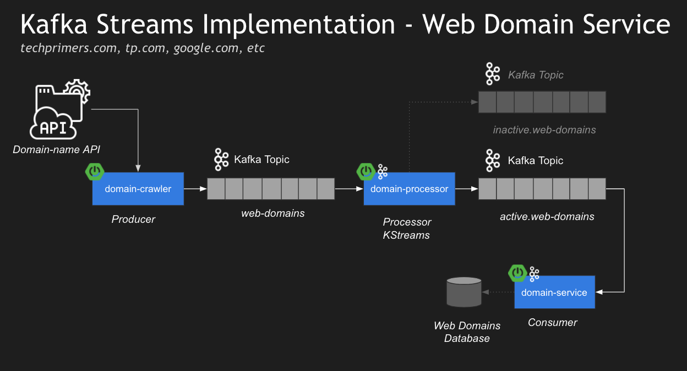

# Spring Kafka Streams using Spring Cloud Streams

## Endpoint
- http://localhost:8080/domain/lookup/facebook - to pull all facebook related web domain names

##
- Kafka Servers Start (local: eg. C:\kafka_2.13-3.7.0)
1) .\bin\windows\zookeeper-server-start.bat .\config\zookeeper.properties
2) .\bin\windows\kafka-server-start.bat .\config\server.properties

## 
- Accesssing Kafka through Conduktor (download it https://www.conduktor.io/get-started/desktop/ and create account free).
- Configure the desktop connection (Cluster Name: local, Bootstrap Server: localhost:9092, Zookeeper: localhost:2123), test the connect and save
-

## Microservices
- 'domain-crawler' - uses Spring Kafka (http://localhost:8080/domain/lookup/facebook) as Producer
- 'domain-processor' - uses Spring Cloud Stream with Kafka Streams binder as Consumer
- 'domain-service' - uses Spring Cloud Stream with Kafka Streams binder as Consumer

## Architecture
